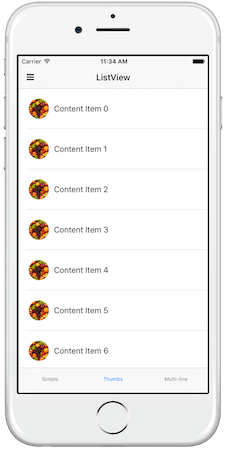
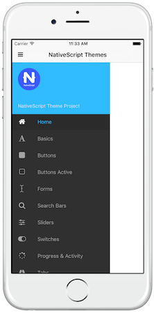
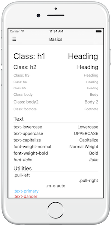
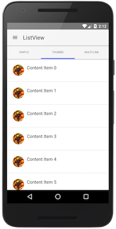
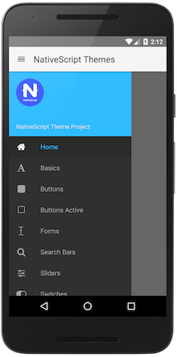
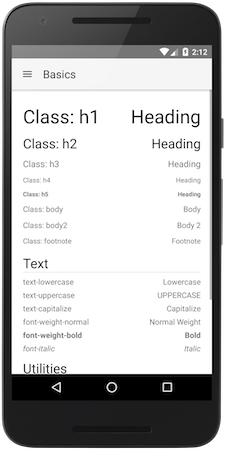

# NativeScript Theme: Core V2
[](https://www.npmjs.com/package/@nativescript/theme)
[](https://www.npmjs.com/package/@nativescript/theme)

Home of the core NativeScript Theme 2.0.

- [Breaking Changes](#breaking-changes)
- [Usage](#usage)
- [Usage before NativeScript 6.1](#usage-before-nativescript-61)
- [Setting Dark or Light mode](#setting-dark-or-light-mode)
- [Setting Dark or Light mode from JavaScript](#setting-dark-or-light-mode-from-javascript)
- [More root classes](#more-root-classes)
- [Using Theme variables](#using-theme-variables)
- [CSS variables](#css-variables)
- [Kendo UI ThemeBuilder support](#kendo-ui-themebuilder-support)
- [Theme classes and compatibility](#theme-classes-and-compatibility)
- [Should I use sass or node-sass](#should-i-use-sass-or-node-sass)
- [Screenshots 📸](#screenshots)
- [Changelog 📝](https://github.com/NativeScript/theme/blob/master/CHANGELOG.md)
- [Contributing 🍺](#contributing)
- [Publishing 📚](#publishing)
- [Contributors 💖](#awesome-contributors)
- [License 📋](#license)

## Breaking changes

---
**NOTE**

NativeScript Theme 1.0 to 2.0 migration guide is available [here](MIGRATION-GUIDE.md).

---

* The theme requires 2 files to be loaded - the core theme and a skin on top of it. Read [Usage](#usage) for more info.
* The theme is now **applied using Element selectors**, if you need the old classes approach - it has moved to
.compat CSS/SCSS files, e.g. `core.compat.css` and `blue.compat.css`.
* Theme 2.0 replaces node-sass with **sass** which is more up to date feature-wise and doesn't have a native dependency.
It does still work with node-sass though.

## Usage

The core theme supports light and dark core styling and skins on top of that. To load the core theme styling, just
load the core CSS and its default skin:

```css
@import "~@nativescript/theme/css/core.css";
@import "~@nativescript/theme/css/default.css";
```

or alternatively SCSS:

```scss
@import "~@nativescript/theme/core";
@import "~@nativescript/theme/default";
```

If you want, you can choose from several different skins. To do that, you can change the second CSS/SCSS file to the
preferred skin name:

```css
@import "~@nativescript/theme/css/core.css";
@import "~@nativescript/theme/css/blue.css";
```

or

```scss
@import "~@nativescript/theme/core";
@import "~@nativescript/theme/blue";
```

In order to import just the Theme variables in one of your modules, use this:

```scss
@import "~@nativescript/theme/scss/variables";
```

It will import just the variables and mixins, without any additional styling.

Here is the old list of Theme skins - the first two are now the Core default Light and Dark skins, the rest are
all the Light skins available, listed by name.


The theme will style your application using Element selectors - you don't need to add CSS classes on every element you
need to style.

Additionally, if you need to create you own skin, you can start just from the core theme - it includes the sizing and
initial styling of the components.

## Usage before NativeScript 6.1

In order to use Theme 2.0 before {N} 6.1, you will also need to include a small JS file in your project:

```javascript
import "@nativescript/theme";
```

This JS takes care of updating several classes on the app root elements, something that got
[included in tns-core-modules](https://github.com/NativeScript/NativeScript/issues/7313) in {N} 6.1.

## Setting Dark or Light mode

Setting the theme mode from light to dark is now easier - instead of loading a new file, just find the root view and
set `.ns-dark` class to it - this will change all colorization to dark tones. For instance, if your page root is
RadSideDrawer, just add a class to it, like this:

```html
<drawer:RadSideDrawer class="ns-dark" xmlns:drawer="nativescript-ui-sidedrawer">
    ...
</drawer:RadSideDrawer>
```

If your root is a frame, you can do this

```html
<Frame class="ns-dark" defaultPage="root"></Frame>
```

For **Angular**, if your root is a `page-router-outlet`, you can set the .ns-dark class on it - it will pass it down to the
Frame it renders.

## Setting Dark or Light mode from JavaScript

Setting the theme mode from JavaScript is also much easier now - just import the theme and call Theme.setMode() with
your preferred mode - either Theme.Light or Theme.Dark, like this:

```javascript
import Theme from "@nativescript/theme";

Theme.setMode(Theme.Dark); // Or Theme.Light
```

Keep in mind that in {N} 6.2 these changes will override the default system mode. To 
restore it, use Theme.Auto (available since Theme 2.3.0):

```javascript
import Theme from "@nativescript/theme";

Theme.setMode(Theme.Auto);
```

Additionally there is another helper method - toggleMode, which can be used without parameters to just toggle the mode
or with a boolean parameter to ensure light or dark mode is set:

```javascript
import Theme from "@nativescript/theme";

Theme.toggleMode(); // to toggle between the modes

// or

Theme.toggleMode(true);  // to ensure dark mode
Theme.toggleMode(false); // to ensure light mode
```

##### A note of warning

Due to limitation in Playground the JS Theme API cannot be imported like an ES6 module in a TS/Angular projects. You'll
have to resort to requiring it:

```javascript
const Theme = require("@nativescript/theme");

Theme.setMode(Theme.Dark); // Or Theme.Light
```

## More root classes

In addition to `.ns-light` and `.ns-dark` classes, the theme's little JavaScript file introduces `.ns-root` on the root element,
`.ns-android/.ns-ios` depending on the current platform (which the theme extensively uses) and additionally
`.ns-portrait/.ns-landscape` and `.ns-phone/.ns-tablet`, which should be self-explanatory.
Of course `.ns-portrait/.ns-landscape` get updated on orientation change, so you can use it to show a two pane layout
in landscape, for instance.

The newest addition is `.ns-statusbar-transparent` since 2.0.4 - add this class to your root element, if you have enabled
transparent status bar in the OS and your ActionBar gets underneath it.

> Keep in mind that **Android APIs before 21** don't support transparent status bars and this will result
in an undesired top ActionBar padding!

## Using Theme variables

There are several functions and mixins in the core theme, that can be used in your projects, as long as you're using
SASS/SCSS.

If you need to access specific theme variables like simple colors or sizes, do it through the `const` function:

```scss
Button {
    background-color: const(forest);
    height: const(btn-height);
}
```

You can get light/dark colors:

```scss
Button {
    color: light(primary);

    .ns-dark & {
        color: dark(primary);
    }
}
```

or alternatively set them both in one go - this mixin does the same as the upper example:

```scss
Button {
    @include colorize($color: primary);
}
```

You can darken/lighten a color depending on its background (darken for light theme and lighten for dark theme):

```scss
Button {
    @include colorize($contrasted-border-color: accent background 20%);
}
```

The above example uses the contrasted function to check the contrast level of the background and adjust the lightness of
the accent color according to it.

## CSS variables

The Theme now exports all its internal variables to custom CSS ones in the .ns-root and .ns-modal classes.
This is also done for Kendo based skins. You can use them to inherit your styles from the Theme, if using CSS.
A list of the supported custom CSS variables follows:

| Simple Colors | Constants | Light Colors | Dark Colors |
|---------|---------|---------|---------|
| --color-black | --const-font-size | --light-primary | --dark-primary |
| --color-white | --const-background-alt-10 | --light-background | --dark-background |
| --color-grey | --const-btn-color-secondary | --light-accent | --dark-accent |
| --color-grey-light | --const-btn-color-disabled | --light-complementary-color | --dark-complementary-color |
| --color-charcoal | --const-btn-font-size | --light-complementary | --dark-complementary |
| --color-transparent | --const-btn-min-width | --light-background-alt-5 | --dark-background-alt-5 |
| --color-aqua | --const-btn-height | --light-background-alt-10 | --dark-background-alt-10 |
| --color-blue | --const-btn-padding-x | --light-background-alt-20 | --dark-background-alt-20 |
| --color-brown | --const-btn-padding-y | --light-secondary | --dark-secondary |
| --color-forest | --const-btn-margin-x | --light-disabled | --dark-disabled |
| --color-grey-dark | --const-btn-margin-y | --light-text-color | --dark-text-color |
| --color-purple | --const-btn-radius | --light-headings-color | --dark-headings-color |
| --color-lemon | --const-headings-margin-bottom | --light-tab-text-color | --dark-tab-text-color |
| --color-lime | --const-headings-font-weight | --light-accent-dark | --dark-accent-dark |
| --color-orange | --const-border-width | --light-accent-light | --dark-accent-light |
| --color-ruby | --const-border-radius | --light-accent-transparent | --dark-accent-transparent |
| --color-sky | --const-border-radius-sm | --light-primary-accent | --dark-primary-accent |
| --color-error | --const-border-radius-lg | --light-background-accent | --dark-background-accent |
|  | --const-disabled-opacity | --light-background-dark-accent | --dark-background-dark-accent |
|  | --const-icon-font-size | --light-item-active-color | --dark-item-active-color |
|  | --const-icon-font-size-lg | --light-item-active-background | --dark-item-active-background |
|  |  | --light-btn-color | --dark-btn-color |
|  |  | --light-item-active-icon-color | --dark-item-active-icon-color |
|  |  | --light-btn-color-inverse | --dark-btn-color-inverse |
|  |  | --light-btn-color-secondary | --dark-btn-color-secondary |

Use them like this:

```css
.my-accented-class {
    color: var(--light-accent);
}
```

For now these CSS variables are not used internally, so changing them won't change the look of your skin. This is planned
for after HSL color support comes in NativeScript 6.2.

## Kendo UI ThemeBuilder support

The theme now supports inheriting the [Kendo UI ThemeBuilder](https://themebuilder.telerik.com/) theme variables. Just head
there, customize your Keno UI SASS theme and hit the Download button. You will get a ZIP with two files in it - the theme CSS
that you can use to style your web app, and `variables.scss` - the one you need for your NativeScript theme. It will look
something like this:

```scss
$base-theme:Default;
$skin-name:test;
$swatch-name:Default Purple;
$border-radius: 10px;
$accent: #bf70cc;
$info: #3e80ed;
$success: #5ec232;
$warning: #fdce3e;
$error: #d51923;
$text-color: #656565;
$bg-color: #ffffff;
$base-text: #656565;
$base-bg: #f6f6f6;
$hovered-text: #656565;
$hovered-bg: #ededed;
$selected-text: #ffffff;
$selected-bg: #bf70cc;
$series-a: #ff6358;
$series-b: #ffd246;
$series-c: #78d237;
$series-d: #28b4c8;
$series-e: #2d73f5;
$series-f: #aa46be;
```

Take this file, add the following under it:

```scss
// Uncomment this row, if you target compat styling:
// $compat: true;

@import '~@nativescript/theme/index';
```

And load the file after your core theme. It should just work&trade;. If it doesn't - head for the issues section.

## Theme classes and compatibility

The old generic theme classes have been retired to avoid clashes with user code. They now live in the .compat world -
if you want to use them, you should load them separately, like this:

```scss
@import "~@nativescript/theme/core.compat";
@import "~@nativescript/theme/blue.compat";
```

As of 2.0, the theme now utilizes a simplified BEM approach for the new element classes, that might be needed here or there.
For instance, the buttons need `.-primary` and `.-outline` modifiers, instead of the old `.btn-primary` and
`.btn-outline` classes. All element classes (which are not needed by default, except if you want to style a component
to look like another one) are namespaced, so for instance a button is `.nt-button`, an action bar is `.nt-action-bar` and a ListView is
`.nt-list-view`.

## Should I use sass or node-sass

Theme 2.0 is developed using SASS. The NPM package used was sass (formerly dart-sass), however it can be used with either sass or node-sass. The difference between them is that sass doesn't depend on a native module (unless you add fibers) and is a little slower (30%) than node-sass, however it doesn't need recompilation if you change Node versions often. If you decide to use it, you should update your webpack config and change the sass-loader options to load sass instead (node-sass is the default sass-loader implementation), like this:

```javascript
{
    loader: "sass-loader",
    options: {
        implementation: require("sass")
    }
}
```

## Screenshots




<br>




## Contributing

Clone this repo, and then use the `tns run` command to launch the demo app on your device or emulator of choice.

```
tns run ios

// or

tns run android
```

If you’d like to toggle the color scheme from light to dark, open the sidedrawer, scroll down to "Themes" at the bottom, and toggle away.

## Publishing

*NOTE*: Only authorized authors can publish updates.

**IMPORTANT**: Always make sure you have run the demo app in iOS or Android to verify any changes as well as ensure the latest `css` has been built before doing the following:

* Bump version in `package.json`
* Adjust `nativescript-theme-core.md` if any changes to the published `README` are needed.

```
npm run builder
cd nativescript-theme-core
npm publish
```

**IMPORTANT**: Never modify the contents of `nativescript-theme-core` folder directly. The builder creates that everytime and any change you make there will be overwritten.

Setup changelog generation:

```
npm install -g conventional-changelog-cli
```

Generate changelog workflow:

1. Make changes
2. Commit those changes - using [these conventions](https://gist.github.com/stephenparish/9941e89d80e2bc58a153).
3. Make sure Travis turns green
4. Bump version in `package.json` and `nativescript-theme-core.json`
5. `conventional-changelog -p angular -i CHANGELOG.md -s`
6. Commit package.json and CHANGELOG.md files
7. Tag
8. Push

## Awesome Contributors

[](https://github.com/NathanWalker) |[](https://github.com/TheOriginalJosh) |[](https://github.com/tjvantoll) |[](https://github.com/NathanaelA) |[](https://github.com/triniwiz) |[](https://github.com/sis0k0) |
:---: |:---: |:---: |:---: |:---: |:---: |
[NathanWalker](https://github.com/NathanWalker) |[TheOriginalJosh](https://github.com/TheOriginalJosh) |[tjvantoll](https://github.com/tjvantoll) |[NathanaelA](https://github.com/NathanaelA) |[triniwiz](https://github.com/triniwiz) |[sis0k0](https://github.com/sis0k0) |
[](https://github.com/sitefinitysteve) |[](https://github.com/vakrilov) |[](https://github.com/bradmartin) |[](https://github.com/firescript) |[](https://github.com/valentinstoychev) |[](https://github.com/enchev) |
[sitefinitysteve](https://github.com/sitefinitysteve) |[vakrilov](https://github.com/vakrilov) |[　bradmartin　](https://github.com/bradmartin) |[　firescript　　](https://github.com/firescript) |[valentinstoychev](https://github.com/valentinstoychev) |[　　enchev　　](https://github.com/enchev) |
[](https://github.com/bundyo) | | | | | |
[　　bundyo　　](https://github.com/bundyo) | | | | | |

## LICENSE

Apache 2.0
